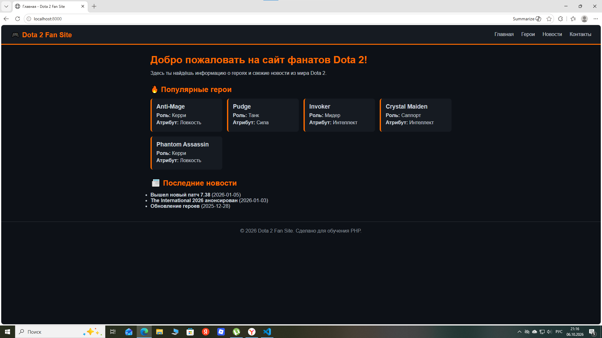
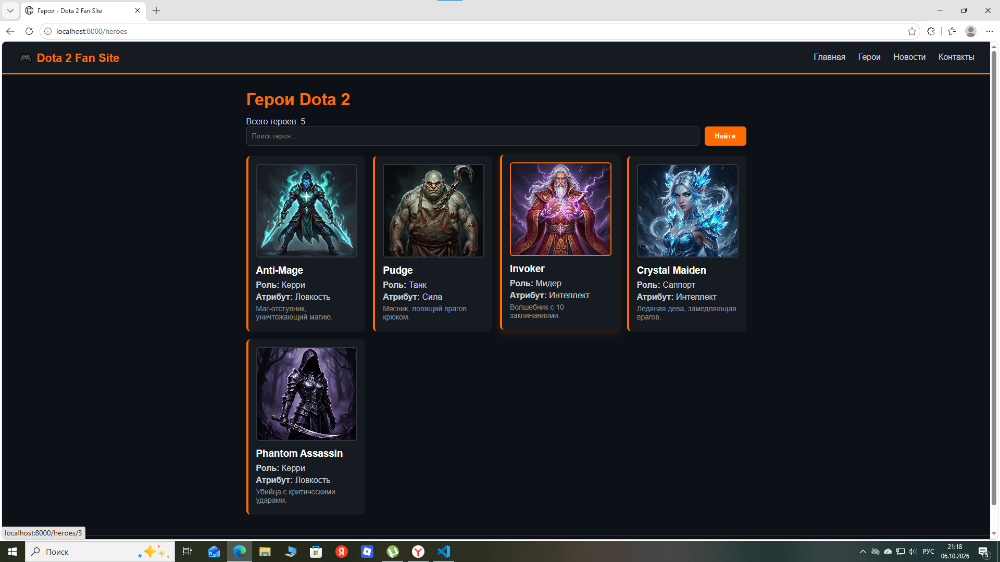
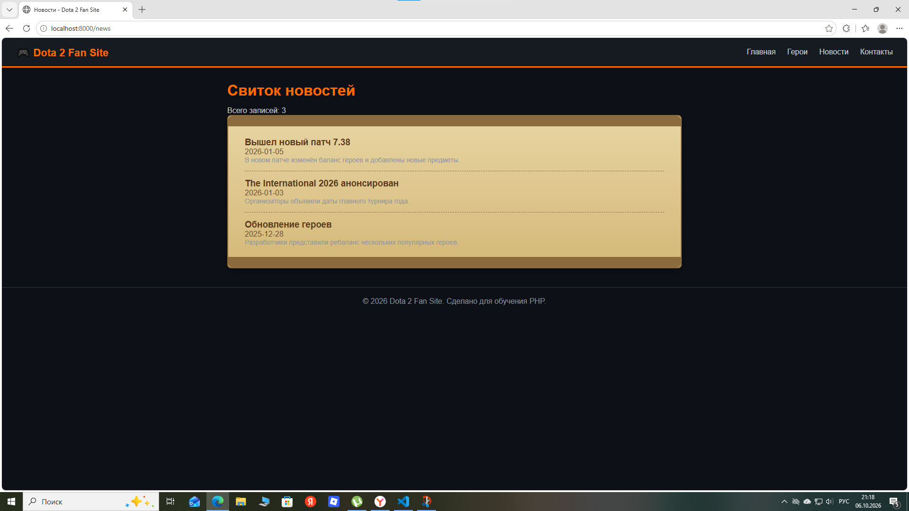

@'
# 🎮 Dota 2 Fan Site

Учебный проект на нативном PHP по архитектуре **MVC**. Сайт фанатов Dota 2 с каталогом героев, новостями и формой обратной связи.

## 📸 Скриншоты

### Главная страница


### Каталог героев


### Новости


## ✨ Возможности

- 🦸 Каталог героев с портретами, ролями и атрибутами
- 🔍 Поиск по героям (имя, роль, атрибут)
- 📜 Новости в виде свитка
- 📬 Форма обратной связи с валидацией
- 📱 Адаптивный дизайн

## 🛠️ Технологии

- **PHP 8.5** (нативный, без фреймворков)
- **MVC-архитектура** (фронт-контроллер, роутер, контроллеры, представления)
- **CSS** (тёмная тема, адаптивность)
- **Composer** (автозагрузка)

## 🚀 Локальный запуск

```bash
cd dota2-fans
php -S localhost:8000 -t public
